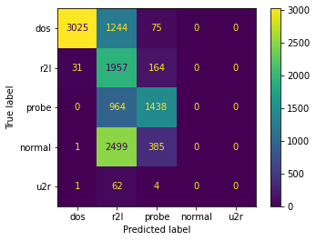

### Section 2.1 Types of AI based on system's capability

##### Fig. 1: The division of AI into subcategories.

### Section 3.1 Balancing the classes in the training dataset

##### Fig. 2: Balancing the data representing specific categories in subsequent experiments examining the effect of class proportion on classification efficiency. \([back to ToC](./README.md/#table-of-contents)\)
###### Fig. 2a): Phase 1, test 1.

###### Fig. 2b): Phase 1, test 2.

###### Fig. 2c): Phase 1, test 3.

###### Fig. 2d): Phase 1, test 4.

###### Fig. 2e): Phase 2, test 1.

###### Fig. 2f): Phase 2, test 2.

###### Fig. 2g): Phase 2, test 3.

###### Fig. 2h): Phase 2, test 4.

##### Appendix - Table 1: Balancing the data representing specific categories in subsequent experiments. Phase 1. Tests 1-4.
|                                | **Gaussian Naive Bayes** | **Decision Tree** | **Random Forest** | **Support Vector Machine** | **Logistic Regression** | **Gradient Boosting Classifier** | **Artifical Neural Network** |
|:------------------------------:|:------------------------:|:-----------------:|:-----------------:|:--------------------------:|:-----------------------:|:--------------------------------:|:----------------------------:|
| **accuracy - Test 1**          | 0.788090617              | 0.983396009       | 0.999347971       | 0.995375144                | 0.992873173             | 0.997892279                      | 0.997179596                  |
| **accuracy - Test 2**          | 0.840920119              | 0.986398374       | 0.999438952       | 0.994495663                | 0.991872384             | 0.998483654                      | 0.996603384                  |
| **accuracy - Test 3**          | 0.868259841              | 0.989127798       | 0.999454115       | 0.994313702                | 0.991660096             | 0.998210711                      | 0.982137442                  |
| **accuracy - Test 4**          | 0.87946564               | 0.990007278       | 0.999484442       | 0.993980106                | 0.991508461             | 0.997998423                      | 0.995481288                  |
| **precision - Test 1**         | 0.478866698              | 0.718968175       | 0.997570198       | 0.946591622                | 0.962864439             | 0.838271515                      | 0.765674833                  |
| **precision - Test 2**         | 0.514266942              | 0.680948442       | 0.997008149       | 0.973315233                | 0.964196656             | 0.934233802                      | 0.753239457                  |
| **precision - Test 3**         | 0.526895948              | 0.703191197       | 0.996491846       | 0.97648385                 | 0.966282058             | 0.846546908                      | 0.562781148                  |
| **precision - Test 4**         | 0.533842018              | 0.70943447        | 0.998149066       | 0.961254041                | 0.965549413             | 0.852603335                      | 0.754760315                  |
| **recall - Test 1**            | 0.751614794              | 0.690097295       | 0.908679934       | 0.888800251                | 0.834703121             | 0.838808544                      | 0.751232728                  |
| **recall - Test 2**            | 0.753583042              | 0.757052243       | 0.912990392       | 0.8922562                  | 0.827226062             | 0.899330536                      | 0.7368383                    |
| **recall - Test 3**            | 1                        | 0.759363          | 0.941842058       | 0.893215791                | 0.838728740             | 0.871670651                      | 0.523243547                  |
| **recall - Test 4**            | 0.753903241              | 0.759221728       | 0.931995718       | 0.89320211                 | 0.830819149             | 0.892551248                      | 0.685108783                  |
| **F1 score - Test 1**          | 0.465364182              | 0.692001826       | 0.943034962       | 0.913105852                | 0.877576313             | 0.834622621                      | 0.758138942                  |
| **F1 score - Test 2**          | 0.491148327              | 0.713951667       | 0.944984167       | 0.922727169                | 0.869677036             | 0.915752635                      | 0.744099374                  |
| **F1 score - Test 3**          | 0.504072073              | 0.728534464       | 0.965563633       | 0.92478139                 | 0.881298876             | 0.853516521                      | 0.538579575                  |
| **F1 score - Test 4**          | 0.50802872               | 0.732097789       | 0.959729994       | 0.920309378                | 0.872158227             | 0.861681977                      | 0.705678128                  |
| **training time [s] - Test 1** | 0.280911922              | 0.512638092       | 3.599793673       | 47.94235444                | 24.66667128             | 173.3595228                      | 383.1870954                  |
| **training time [s] - Test 2** | 0.289343834              | 0.450932741       | 3.189850092       | 196.2963231                | 25.62498522             | 164.6663039                      | 383.2783947                  |
| **training time [s] - Test 3** | 0.252176523              | 0.467223883       | 2.778242111       | 148.9766731                | 24.80764747             | 141.0719762                      | 383.1251719                  |
| **training time [s] - Test 4** | 0.274205923              | 0.477915049       | 2.962523937       | 39.00502419                | 25.37594533             | 148.5559638                      | 443.2558608                  |
| **testing time [s] - Test 1**  | 0.081558704              | 0.013059378       | 0.223374844       | 15.17415905                | 0.025176287             | 0.431893826                      | 2.198399305                  |
| **testing time [s] - Test 2**  | 0.093053818              | 0.014310837       | 0.224369049       | 16.68049359                | 0.021506310             | .382436752                       | 1.880304813                  |
| **testing time [s] - Test 3**  | 0.076644897              | 0.014477015       | 0.213822842       | 16.62825489                | 0.024678707             | 0.343240499                      | 2.662583351                  |
| **testing time [s] - Test 4**  | 0.082398176              | 0.010836363       | 0.215702772       | 16.73944354                | 0.017801762             | 0.389178753                      | 2.140201807                  |

##### Appendix - Table 2: Balancing the data representing specific categories in subsequent experiments. Phase 2. Tests 1-4.
|                                | **Gaussian Naive Bayes** | **Decision Tree** | **Random Forest** | **Support Vector Machine** | **Logistic Regression** | **Gradient Boosting Classifier** | **Artifical Neural Network** |
|:------------------------------:|:------------------------:|:-----------------:|:-----------------:|:--------------------------:|:-----------------------:|:--------------------------------:|:----------------------------:|
| **accuracy - Test 1**          | 0.823248408              | 0.961170995       | 0.99755022        | 0.987628613                | 0.974644782             | 0.994610485                      | 0.941205292                  |
| **accuracy - Test 2**          | 0.862094305              | 0.967299449       | 0.99706062        | 50.986282915               | 0.973913043             | 0.993998775                      | 0.95223515                   |
| **accuracy - Test 3**          | 0.875688916              | 0.966442131       | 0.99718309        | 90.985180649               | 0.975505205             | 0.996815677                      | 0.947213717                  |
| **accuracy - Test 4**          | 0.890753215              | 0.970483772       | 0.99742804        | 70.986527863               | 0.977587263             | 0.994978567                      | 0.943539498                  |
| **precision - Test 1**         | 0.667745017              | 0.761099762       | 0.99588349        | 60.982598202               | 0.967467296             | 0.94128593                       | 0.551448544                  |
| **precision - Test 2**         | 0.702051608              | 0.96557862        | 0.97946513        | 40.941223408               | 0.928075516             | 0.925548428                      | 0.568471196                  |
| **precision - Test 3**         | 0.706717892              | 0.960806119       | 0.96321680        | 90.940721245               | 0.928931358             | 0.949594138                      | 0.549191166                  |
| **precision - Test 4**         | 0.713178347              | 0.761101096       | 0.97752368        | 10.937689906               | 0.925253209             | 0.901099638                      | 0.541723378                  |
| **recall - Test 1**            | 0.770343488              | 0.7543033         | 0.93037586        | 50.862255884               | 0.844306225             | 0.940228263                      | 0.584127822                  |
| **recall - Test 2**            | 0.752411853              | 0.77007143        | 0.96387108        | 0.838376123                | 0.819877477             | 0.943616114                      | 0.596212818                  |
| **recall - Test 3**            | 0.750863943              | 0.768973202       | 0.94775076        | 50.838334989               | 0.821413508             | 0.947978833                      | 0.593287777                  |
| **recall - Test 4**            | 0.754806399              | 0.755696852       | 0.94923665        | 90.837954984               | 0.824746257             | 0.897230401                      | 0.58456081                   |
| **F1 score - Test 1**          | 0.617950534              | 0.757598124       | 0.95646081        | 70.898361384               | 0.881792305             | 0.940751928                      | 0.566834346                  |
| **F1 score - Test 2**          | 0.645733651              | 0.788354485       | 0.97138155        | 0.867828445                | 0.851864056             | 0.933835114                      | 0.58120503                   |
| **F1 score - Test 3**          | 0.648610185              | 0.785254997       | 0.95520679        | 30.867450747               | 0.852906031             | 0.948774287                      | 0.569721202                  |
| **F1 score - Test 4**          | 0.653786952              | 0.757731046       | 0.96221223        | 40.865804281               | 0.853022270             | .899118055                       | 0.561339961                  |
| **training time [s] - Test 1** | 0.034688950              | .070534706        | 0.29839325        | 1.169124603                | 2.329178333             | 13.63196087                      | 82.99710011                  |
| **training time [s] - Test 2** | 0.092787504              | 0.048669577       | 0.28320837        | 0.984944105                | 2.015844107             | 12.26780319                      | 41.95775175                  |
| **training time [s] - Test 3** | 0.033340454              | 0.055726767       | 0.27419614        | 80.948962212               | 2.509886981             | 1.56155038                       | 42.02240062                  |
| **training time [s] - Test 4** | 0.034053326              | 0.048427582       | 0.26780247        | 71.01111722                | 2.068534136             | 11.84710741                      | 48.76318455                  |
| **testing time [s] - Test 1**  | 0.015185833              | 0.00337863        | 0.03494453        | 40.796063423               | 0.003355980             | .060704947                       | 0.419556856                  |
| **testing time [s] - Test 2**  | 0.021794319              | 0.00260067        | 0.03624773        | 0.692670584                | 0.006877899             | 0.060223818                      | 0.420044661                  |
| **testing time [s] - Test 3**  | 0.013423920              | .002349377        | 0.03344059        | 0.72351861                 | 0.016741753             | 0.0550282                        | 0.335494041                  |
| **testing time [s] - Test 4**  | 0.016203403              | 0.004794121       | 0.04400825        | 50.713534117               | 0.003633022             | 0.055040359                      | 0.456575871                  |

##### Fig. 3: GNB – confusion matrices for experiments examining the effect of class balance on classification efficiency.
###### Fig. 3a): Phase 1, test 1.

###### Fig. 3b): Phase 1, test 2.

###### Fig. 3c): Phase 1, test 3.

###### Fig. 3d): Phase 1, test 4.

###### Fig. 3e): Phase 2, test 1.

###### Fig. 3f): Phase 2, test 2.

###### Fig. 3g): Phase 2, test 3.

###### Fig. 3h): Phase 2, test 4.

##### Fig. 4: DT – confusion matrices for experiments examining the effect of class balance on classification efficiency.
###### Fig. 4a): Phase 1, test 1.

###### Fig. 4b): Phase 1, test 2.

###### Fig. 4c): Phase 1, test 3.

###### Fig. 4d): Phase 1, test 4.

###### Fig. 4e): Phase 2, test 1.

###### Fig. 4f): Phase 2, test 2.

###### Fig. 4g): Phase 2, test 3.

###### Fig. 4h): Phase 2, test 4.

##### Fig. 5: RF – confusion matrices for experiments examining the effect of class balance on classification efficiency.
###### Fig. 5a): Phase 1, test 1.

###### Fig. 5b): Phase 1, test 2.

###### Fig. 5c): Phase 1, test 3.

###### Fig. 5d): Phase 1, test 4.

###### Fig. 5e): Phase 2, test 1.

###### Fig. 5f): Phase 2, test 2.

###### Fig. 5g): Phase 2, test 3.

###### Fig. 5h): Phase 2, test 4.

##### Fig. 6: SVM – confusion matrices for experiments examining the effect of class balance on classification efficiency.
###### Fig. 6a): Phase 1, test 1.

###### Fig. 6b): Phase 1, test 2.

###### Fig. 6c): Phase 1, test 3.

###### Fig. 6d): Phase 1, test 4.

###### Fig. 6e): Phase 2, test 1.

###### Fig. 6f): Phase 2, test 2.

###### Fig. 6g): Phase 2, test 3.

###### Fig. 6h): Phase 2, test 4.

##### Fig. 7: LogR – confusion matrices for experiments examining the effect of class balance on classification efficiency.
###### Fig. 7a): Phase 1, test 1.

###### Fig. 7b): Phase 1, test 2.

###### Fig. 7c): Phase 1, test 3.

###### Fig. 7d): Phase 1, test 4.

###### Fig. 7e): Phase 2, test 1.

###### Fig. 7f): Phase 2, test 2.

###### Fig. 7g): Phase 2, test 3.

###### Fig. 7h): Phase 2, test 4.

##### Fig. 8: GBC – confusion matrices for experiments examining the effect of class balance on classification efficiency.
###### Fig. 8a): Phase 1, test 1.

###### Fig. 8b): Phase 1, test 2.

###### Fig. 8c): Phase 1, test 3.

###### Fig. 8d): Phase 1, test 4.

###### Fig. 8e): Phase 2, test 1.

###### Fig. 8f): Phase 2, test 2.

###### Fig. 8g): Phase 2, test 3.

###### Fig. 8h): Phase 2, test 4.

##### Fig. 9: ANN – confusion matrices for experiments examining the effect of class balance on classification efficiency.
###### Fig. 9a): Phase 1, test 1.

###### Fig. 9b): Phase 1, test 2.

###### Fig. 9c): Phase 1, test 3.

###### Fig. 9d): Phase 1, test 4.

###### Fig. 9e): Phase 2, test 1.

###### Fig. 9f): Phase 2, test 2.

###### Fig. 9g): Phase 2, test 3.

###### Fig. 9h): Phase 2, test 4.

##### Fig. 10: Accuracy graph for experiments examining the effect of class balance on classification efficiency.
###### Fig. 10a): Phase 1.

###### Fig. 10b): Phase 2.

##### Fig. 11: Precision graph for experiments examining the effect of class balance on classification efficiency.
###### Fig. 11a): Phase 1.

###### Fig. 11b): Phase 2.

##### Fig. 12: Recall graph for experiments examining the effect of class balance on classification efficiency.
###### Fig. 12a): Phase 1.

###### Fig. 12b): Phase 2.

##### Fig. 13: F1score graph for experiments examining the effect of class balance on classification efficiency.
###### Fig. 13a): Phase 1.

###### Fig. 13b): Phase 2.

##### Appendix - Table 3: Removing samples from training datasets to balance classes. Tests 1-7.
|                                | **Gaussian Naive Bayes** | **Decision Tree** | **Random Forest** | **Support Vector Machine** | **Logistic Regression** | **Gradient Boosting Classifier** | **Artifical Neural Network** |
|:------------------------------:|:------------------------:|:-----------------:|:-----------------:|:--------------------------:|:-----------------------:|:--------------------------------:|:----------------------------:|
| **accuracy - Test 1**          | 0.879038441              | 0.990523042       | 0.999681034       | 0.998791611                | 0.993528679             | 0.997718169                      | 0.998300895                  |
| **accuracy - Test 2**          | 0.847870698              | 0.987616319       | 0.999441261       | 0.997429802                | 0.992736397             | 0.996789792                      | 0.997937746                  |
| **accuracy - Test 3**          | 0.801061369              | 0.98344446        | 0.999213801       | 0.994481487                | 0.992153127             | 0.998246171                      | 0.997263422                  |
| **accuracy - Test 4**          | 0.742123897              | 0.978396976       | 0.99885984        | 0.995079311                | 0.991658832             | 0.99763967                       | 0.990338647                  |
| **accuracy - Test 5**          | 0.842197494              | 0.970997985       | 0.996495225       | 0.988521861                | 0.979584684             | 0.995531412                      | 0.753789538                  |
| **accuracy - Test 6**          | 0.820114872              | 0.959550287       | 0.995967249       | 0.986801906                | 0.974581449             | 0.994134181                      | 0.94305267                   |
| **accuracy - Test 7**          | 0.77999391               | 0.957673569       | 0.995127893       | 0.985079172                | 0.971680877             | 0.992996346                      | 0.918848965                  |
| **training time [s] - Test 1** | 0.651753187              | 1.22456646        | 8.286151409       | 168.6448584                | 74.01778364             | 385.6025615                      | 876.7828295                  |
| **training time [s] - Test 2** | 0.437844038              | 0.730237007       | 4.467791557       | 295.537842                 | 41.30871987             | 265.3924713                      | 501.8228085                  |
| **training time [s] - Test 3** | 0.304876566              | 0.623074532       | 4.274698257       | 515.5963695                | 23.94408965             | 174.5776298                      | 340.6978385                  |
| **training time [s] - Test 4** | 0.195254564              | 0.385010242       | 2.782250643       | 162.2131186                | 18.67781138             | 131.5465636                      | 323.0535951                  |
| **training time [s] - Test 5** | 0.054320335              | 0.066307306       | 0.414738417       | 1.74523139                 | 3.388866901             | 17.73681998                      | 66.90115738                  |
| **training time [s] - Test 6** | 0.040648699              | 0.057965517       | 0.370072842       | 1.11452055                 | 2.473671913             | 13.08205295                      | 83.01034474                  |
| **training time [s] - Test 7** | 0.031551361              | 0.042174339       | 0.275158644       | 0.870727539                | 1.738318205             | 11.10962486                      | 41.8148911                   |
| **testing time [s] - Test 1**  | 0.192801952              | 0.0303514         | 0.492928505       | 68.15220022                | 0.031748772             | 1.24418664                       | 5.232775927                  |
| **testing time [s] - Test 2**  | 0.110662699              | 0.018263578       | 0.309320688       | 30.54482365                | 0.02570796              | 0.54990983                       | 2.749738932                  |
| **testing time [s] - Test 3**  | 0.091780663              | 0.018349648       | 0.247037888       | 14.88761806                | 0.018503189             | 0.391586065                      | 2.669147491                  |
| **testing time [s] - Test 4**  | 0.065405846              | 0.012467146       | 0.185686827       | 9.101705551                | 0.015874863             | 0.3187325                        | 2.682014704                  |
| **testing time [s] - Test 5**  | 0.019593239              | 0.006835461       | 0.0496099         | 1.133305073                | 0.004925013             | 0.079644442                      | 0.452754498                  |
| **testing time [s] - Test 6**  | 0.024673462              | 0.003585577       | 0.043826818       | 0.726187468                | 0.001919746             | 0.062636852                      | 0.437098742                  |
| **testing time [s] - Test 7**  | 0.017290831              | 0.004143238       | 0.030399323       | 0.554812193                | 0.011002064             | 0.051285982                      | 0.305068731                  |

##### Appendix - Fig A1: Removing samples from training datasets to balance classes. Test 1: 10\% of KDD'99.

##### Appendix - Fig A2: Removing samples from training datasets to balance classes. Tests 2-7.
###### Fig. A2a): Test 2: reduction of all \textit{DoS} attack by a factor of 2.

###### Fig. A2b): Test 3: reduction of all \textit{DoS} attack by a factor of 4.

###### Fig. A2c): Test 4: reduction of all \textit{DoS} attack by a factor of 8.

###### Fig. A2d): Test 5: reduction of all \textit{DoS} attack by a factor of 20 and \textit{normal} by a factor of 10.

###### Fig. A2e): Test 6: reduction of all \textit{DoS} attack by a factor of 40 and \textit{normal} by a factor of 10.

###### Fig. A2f): Test 7: reduction of all \textit{DoS} attack by a factor of 80 and \textit{normal} by a factor of 10.

##### Fig. 14: Accuracy for datasets of various sizes.

### Section 3.2 Features correlation

##### Fig. 15: Standard correlation coefficient for KDD Cup'99 dataset features.

##### Appendix - Table 4: Different thresholds of acceptable correlation coefficients. Tests 1-4.
|                                | **Gaussian Naive Bayes** | **Decision Tree** | **Random Forest** | **Support Vector Machine** | **Logistic Regression** | **Gradient Boosting Classifier** | **Artifical Neural Network** |
|:------------------------------:|:------------------------:|:-----------------:|:-----------------:|:--------------------------:|:-----------------------:|:--------------------------------:|:----------------------------:|
| **accuracy - Test 1**          | 0.879038441              | 0.990523042       | 0.999681034       | 0.998791611                | 0.993528679             | 0.997718169                      | 0.998300895                  |
| **accuracy - Test 2**          | 0.879167255              | 0.990437167       | 0.999668767       | 0.998895888                | 0.994951756             | 0.985450263                      | 0.998871353                  |
| **accuracy - Test 3**          | 0.876977433              | 0.990523042       | 0.999668767       | 0.998810013                | 0.993547081             | 0.997705901                      | 0.998533985                  |
| **accuracy - Test 4**          | 0.81853926               | 0.991786637       | 0.999644231       | 0.993430536                | 0.991197777             | 0.998141412                      | 0.992074932                  |
| **training time [s] - Test 1** | 0.651753187              | 1.22456646        | 8.286151409       | 168.6448584                | 74.01778364             | 385.6025615                      | 876.7828295                  |
| **training time [s] - Test 2** | 0.662764549              | 1.354340315       | 8.276201248       | 239.5823398                | 76.5234139              | 476.9135578                      | 807.5434766                  |
| **training time [s] - Test 3** | 0.664701462              | 1.219818115       | 8.018393278       | 561.2261219                | 77.33132792             | 460.2660177                      | 1032.204462                  |
| **training time [s] - Test 4** | 0.651105404              | 1.029169559       | 7.678452969       | 336.8036721                | 61.86882544             | 338.4183962                      | 922.7781627                  |
| **testing time [s] - Test 1**  | 0.192801952              | 0.0303514         | 0.492928505       | 68.15220022                | 0.031748772             | 1.24418664                       | 5.232775927                  |
| **testing time [s] - Test 2**  | 0.214771986              | 0.02694416        | 0.489369392       | 62.39677143                | 0.040361404             | 1.763958216                      | 5.227129459                  |
| **testing time [s] - Test 3**  | 0.168973923              | 0.021884441       | 0.770443916       | 63.95166469                | 0.044288874             | 1.66951108                       | 4.988589048                  |
| **testing time [s] - Test 4**  | 0.166803122              | 0.024616003       | 0.47866416        | 82.41538                   | 0.034491062             | 1.119737864                      | 5.231910229                  |

##### Appendix - Fig A3: Different thresholds of acceptable correlation coefficients. Tests 1-4.
###### Fig. A3a): Test 1: The Threshold of correlation coefficients set to 98\%.

###### Fig. A3b): Test 2: The Threshold of correlation coefficients set to 100\%.

###### Fig. A3c): Test 3: The Threshold of correlation coefficients set to 90\%.

###### Fig. A3d): Test 4: The Threshold of correlation coefficients set to 80\%.

##### Fig. 16: Accuracy for the different thresholds of the acceptable correlation coefficients.

### Section 3.3 Data leakage

##### Appendix - Table 5: Comparison of the classifier’s effectiveness due to used training/testing dataset. Tests: 1-4.
|                                | **Gaussian Naive Bayes** | **Decision Tree** | **Random Forest** | **Support Vector Machine** | **Logistic Regression** | **Gradient Boosting Classifier** | **Artifical Neural Network** |
|:------------------------------:|:------------------------:|:-----------------:|:-----------------:|:--------------------------:|:-----------------------:|:--------------------------------:|:----------------------------:|
| **accuracy - Test 1**          | 0.515274262              | 0.541772152       | 0.54092827        | 0.499746835                | 0.535696203             | 0.506582278                      | 0.500253165                  |
| **accuracy - Test 2**          | 0.858042472              | 0.978075831       | 0.99947370        | 70.994894954               | 0.984154520             | 0.995429344                      | 0.996526463                  |
| **accuracy - Test 3**          | 0.399493671              | 0.481012658       | 0.51417721        | 50.535527426               | 0.490801688             | 0.563966245                      | 0.501687764                  |
| **accuracy - Test 4**          | 0.879167255              | 0.990437167       | 0.99972397        | 20.998895888               | 0.994951756             | 0.985450263                      | 0.999122845                  |
| **precision - Test 1**         | 0.361622415              | 0.395240013       | 0.59854596        | 20.671773208               | 0.686836401             | 0.650638603                      | 0.393547523                  |
| **precision - Test 2**         | 0.420805559              | 0.461936418       | 0.99420863        | 90.929149062               | 0.831018935             | 0.723016927                      | 0.561242454                  |
| **precision - Test 3**         | 0.343968724              | 0.376364974       | 0.68365149        | 10.647583781               | 0.692768943             | 0.728588162                      | 0.445667571                  |
| **precision - Test 4**         | 0.466182072              | 0.505786517       | 0.99720277        | 50.93390281                | 0.958698538             | 0.695832709                      | 0.771754982                  |
| **recall - Test 1**            | 0.407256993              | 0.440883439       | 0.43815670        | 30.435619115               | 0.455299358             | 0.465994347                      | 0.421654251                  |
| **recall - Test 2**            | 0.556649855              | 0.57212586        | 0.91748751        | 10.851528124               | 0.751683096             | 0.800682048                      | 0.597982405                  |
| **recall - Test 3**            | 0.462578593              | 0.399928226       | 0.42906289        | 30.51056395                | 0.442755881             | 0.488138565                      | 0.418306226                  |
| **recall - Test 4**            | 0.737881755              | 0.57464552        | 0.90665216        | 80.895146417               | 0.807890979             | 0.778084543                      | 0.774678766                  |
| **F1 score - Test 1**          | 0.362376151              | 0.380380035       | 0.39067724        | 20.391034246               | 0.412615211             | 0.46121419                       | 0.365494119                  |
| **F1 score - Test 2**          | 0.343743731              | 0.489658649       | 0.95021009        | 70.872679043               | 0.749092666             | 0.736552882                      | 0.577805365                  |
| **F1 score - Test 3**          | 0.315700759              | 0.340249359       | 0.39025807        | 30.475030796               | 0.428001512             | 0.480080612                      | 0.381508875                  |
| **F1 score - Test 4**          | 0.447205392              | 0.531672275       | 0.94066762        | 60.912521882               | 0.847420761             | 0.678770866                      | 0.773184161                  |
| **training time [s] - Test 1** | 0.282313824              | 0.459307432       | 3.78406190        | 981.66478419               | 39.56123996             | 134.2557201                      | 383.1044202                  |
| **training time [s] - Test 2** | 0.299851179              | 0.511711836       | 4.02160859        | 190.21626663               | 42.34408236             | 145.634284                       | 386.7983384                  |
| **training time [s] - Test 3** | 1.081671476              | 1.400335789       | 8.53761363        | 193.1413372                | 118.2348928             | 367.5357361                      | 1284.379962                  |
| **training time [s] - Test 4** | 0.702170849              | 1.568134785       | 10.1788358        | 7284.959343                | 83.74073625             | 489.2813292                      | 1223.502899                  |
| **testing time [s] - Test 1**  | 0.014487982              | 0.003983259       | 0.07454991        | 38.261540174               | 0.005537510             | .091407299                       | 0.458831549                  |
| **testing time [s] - Test 2**  | 0.510420561              | 0.063191891       | 1.32546639        | 4313.1300554               | 0.148886442             | 5.798076868                      | 20.67135048                  |
| **testing time [s] - Test 3**  | 0.028802872              | 0.003587008       | 0.05890059        | 55.876841307               | 0.015980721             | 0.086857319                      | 0.470012188                  |
| **testing time [s] - Test 4**  | 0.263990402              | 0.033575535       | 0.51627445        | 264.01787257               | 0.044744968             | 1.937648535                      | 10.44452691                  |

##### Fig. 17: Distribution of data representing the various types of attacks for experiments examining the effect of features correlation on classification efficiency.
###### Fig. 17a): NSL-KDD train dataset.

###### Fig. 17b): NSL-KDD test dataset.

###### Fig. 17c): KDD Cup'99 train/test dataset.

##### Fig. 18: Accuracy graph for experiments examining the effect of features correlation on classification efficiency.

##### Fig. 19: Precision graph for experiments examining the effect of features correlation on classification efficiency.

##### Fig. 20: Recall graph for experiments examining the effect of features correlation on classification efficiency.

##### Fig. 21: F1score graph for experiments examining the effect of features correlation on classification efficiency.

##### Fig. 22: GNB – confusion matrices for experiments examining the effect of features correlation on classification efficiency.
###### Fig. 22a): Train: NSL, test: NSL.

###### Fig. 22b): Train: NSL, test: KDD.

###### Fig. 22c): Train: KDD, test: NSL.

###### Fig. 22d): Train: KDD, test: KDD.

##### Fig. 23: DT – confusion matrices for experiments examining the effect of features correlation on classification efficiency.
###### Fig. 23a): Train: NSL, test: NSL.

###### Fig. 23b): Train: NSL, test: KDD.

###### Fig. 23c): Train: KDD, test: NSL.

###### Fig. 23d): Train: KDD, test: KDD.

##### Fig. 24: RF – confusion matrices for experiments examining the effect of features correlation on classification efficiency.
###### Fig. 24a): Train: NSL, test: NSL.

###### Fig. 24b): Train: NSL, test: KDD.

###### Fig. 24c): Train: KDD, test: NSL.

###### Fig. 24d): Train: KDD, test: KDD.

##### Fig. 25: SVM – confusion matrices for experiments examining the effect of features correlation on classification efficiency.
###### Fig. 25a): Train: NSL, test: NSL.

###### Fig. 25b): Train: NSL, test: KDD.

###### Fig. 25c): Train: KDD, test: NSL.

###### Fig. 25d): Train: KDD, test: KDD.

##### Fig. 26: LogR – confusion matrices for experiments examining the effect of features correlation on classification efficiency.
###### Fig. 26a): Train: NSL, test: NSL.

###### Fig. 26b): Train: NSL, test: KDD.

###### Fig. 26c): Train: KDD, test: NSL.

###### Fig. 26d): Train: KDD, test: KDD.

##### Fig. 27: GBC – confusion matrices for experiments examining the effect of features correlation on classification efficiency.
###### Fig. 27a): Train: NSL, test: NSL.

###### Fig. 27b): Train: NSL, test: KDD.

###### Fig. 27c): Train: KDD, test: NSL.

###### Fig. 27d): Train: KDD, test: KDD.

##### Fig. 28: ANN – confusion matrices for experiments examining the effect of features correlation on classification efficiency.
###### Fig. 28a): Train: NSL, test: NSL.

###### Fig. 28b): Train: NSL, test: KDD.

###### Fig. 28c): Train: KDD, test: NSL.

###### Fig. 28d): Train: KDD, test: KDD.

#### Section 3.4.4 Model theft

##### Fig. 29: An example of a model theft attack from the publication: Goodfellow et al. in [1412.6572](https://arxiv.org/abs/1412.6572).

#### Section 3.4.5 Recovery of training data

##### Fig. 30: An example of an model inversion attack by: Jin et al. in [2110.15122](https://arxiv.org/abs/2110.15122).

